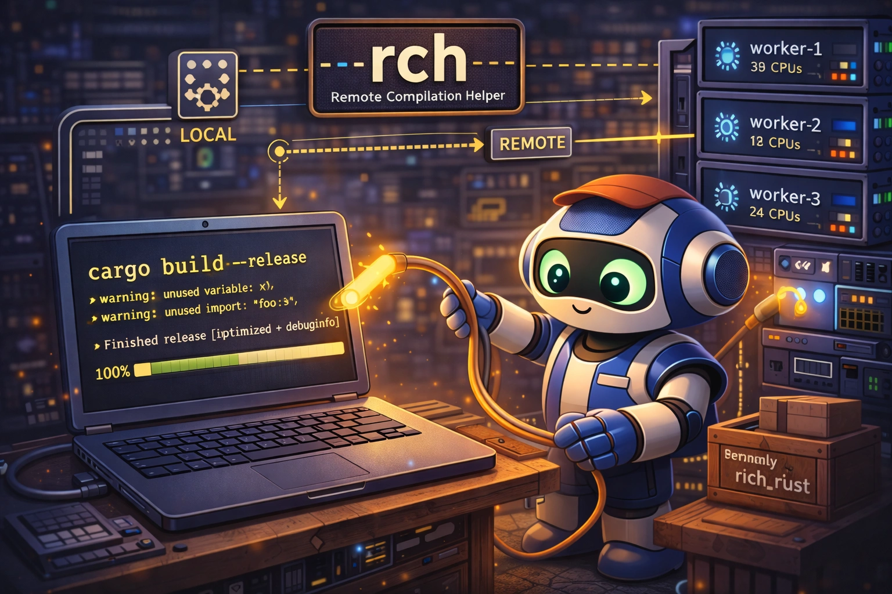
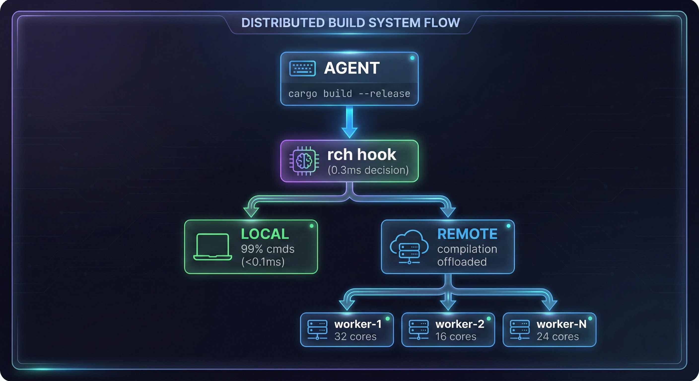

# rch — Remote Compilation Helper

<div align="center">
  
</div>

<div align="center">
<h3>Quick Install</h3>

```bash
curl -fsSL "https://raw.githubusercontent.com/Dicklesworthstone/remote_compilation_helper/main/install.sh?$(date +%s)" | bash -s -- --easy-mode
```

<p><em>Installs `rch` + `rchd`, bootstraps config, and can install/start the background daemon. If remote execution cannot proceed, RCH fails open to local execution.</em></p>
</div>

<div align="center">
  
</div>

<div align="center">

**Transparent remote compilation for multi-agent development**

[](https://github.com/Dicklesworthstone/remote_compilation_helper/actions/workflows/ci.yml)
[](https://opensource.org/licenses/MIT)
[](https://www.rust-lang.org/)
[](https://codecov.io/gh/Dicklesworthstone/remote_compilation_helper)

</div>

---

## TL;DR

**Problem**: Many concurrent AI agents can saturate local CPU and make your workstation unusable.

**Solution**: RCH runs as a Claude Code PreToolUse hook, classifies build-like commands in milliseconds, executes them on remote workers, and returns artifacts/output as if they ran locally.

**Design constraint**: RCH is fail-open. If remote execution is not safe/possible, commands run locally.

---

## What RCH Intercepts

RCH currently recognizes and can offload:

| Ecosystem | Intercepted Commands |
|---|---|
| Rust | `cargo build`, `cargo check`, `cargo clippy`, `cargo doc`, `cargo test`, `cargo nextest run`, `cargo bench`, `rustc` |
| Bun/TypeScript | `bun test`, `bun typecheck` |
| C/C++ | `gcc`, `g++`, `clang`, `clang++` |
| Build Systems | `make`, `cmake --build`, `ninja`, `meson compile` |

RCH explicitly does **not** intercept local-mutating or interactive patterns (examples):

- Package management: `cargo install`, `cargo clean`, `bun install`, `bun add`, `bun remove`
- Bun runners/dev: `bun run`, `bun build`, `bun dev`, `bun x` / `bunx`
- Watch/background/piped/redirected commands where deterministic offload is unsafe

---

## Why It Works Well

- Transparent hook behavior: agents see normal command semantics.
- 5-tier classification pipeline optimized for very fast non-compilation rejection.
- Daemon-owned worker state and slot accounting.
- Cache-aware worker selection and project affinity.
- Queue + cancellation primitives for overloaded scenarios.
- Deterministic reliability subsystems for convergence, pressure handling, and remediation.
- Unified status surface with posture and remediation hints.

---

## Current Architecture

```text
Agent Shell / Claude Code
        |
        v
PreToolUse Hook -> rch (classifier + hook protocol)
        |
        v
      rchd (daemon)
      - worker selection
      - queueing and cancellation metadata
      - health, alerts, telemetry, history
      - reliability subsystems (convergence, pressure, triage)
        |
        v
Remote workers (rch-wkr)
      - execute build/test commands
      - manage worker cache
      - report capabilities/health/telemetry
```

Workspace crates:

- `rch/`: Hook + primary CLI
- `rchd/`: Local daemon + scheduling/reliability APIs
- `rch-wkr/`: Worker execution/caching agent
- `rch-common/`: Shared protocol/types/patterns/UI foundations
- `rch-telemetry/`: Telemetry collection/storage integration

---

## Reliability Model (Operational)

RCH now includes a deterministic reliability stack for multi-repo and multi-worker stability:

- **Path-dependency closure planning**: builds can include required repository closure rather than a single root.
- **Canonical topology enforcement**: worker/project roots are normalized around `/data/projects` and `/dp` conventions.
- **Repo convergence service**: tracks worker drift vs required repos and can repair drift.
- **Disk pressure resilience**: pressure scoring, admission control, safe reclaim with active-build protection.
- **Process triage/remediation**: bounded TERM/KILL escalation with audit trail.
- **Cancellation orchestration**: deterministic cancellation metadata and worker health integration.
- **Unified posture/reporting**: status output includes posture, convergence state, pressure, and actionable remediation hints.

---

## Installation

### Recommended: Installer

```bash
curl -fsSL "https://raw.githubusercontent.com/Dicklesworthstone/remote_compilation_helper/main/install.sh?$(date +%s)" | bash -s -- --easy-mode
```

### From Source

```bash
git clone https://github.com/Dicklesworthstone/remote_compilation_helper.git
cd remote_compilation_helper
cargo build --release
cp target/release/rch ~/.local/bin/
cp target/release/rchd ~/.local/bin/
```

### Source Build Note

This workspace currently uses FrankenTUI path dependencies (`ftui-*`) from `/dp/frankentui/crates/...` in `Cargo.toml`. Ensure that dependency tree is available when building from source in this environment.

---

## First-Time Setup

### Fastest Path

```bash
rch init
```

`rch init` can guide:

1. Worker discovery from SSH config/aliases
2. Worker probing and selection
3. `rch-wkr` deployment
4. Toolchain synchronization
5. Daemon startup
6. Hook installation
7. Validation build

### Manual Path

```bash
# 1) configure workers
mkdir -p ~/.config/rch
cat > ~/.config/rch/workers.toml << 'TOML'
[[workers]]
id = "css"
host = "203.0.113.20"
user = "ubuntu"
identity_file = "~/.ssh/id_rsa"
total_slots = 32
priority = 100
TOML

# 2) start daemon
rch daemon start

# 3) verify workers
rch workers probe --all

# 4) install hook
rch hook install

# 5) check posture
rch check
rch status --workers --jobs
```

---

## Command Surface

Global flags:

```bash
-v, --verbose
-q, --quiet
-j, --json
-F, --format json|toon
--color auto|always|never
```

### Core Operations

```bash
rch daemon start|stop|restart|status|logs|reload
rch workers list|capabilities|probe|benchmark|drain|enable|disable
rch status [--workers] [--jobs]
rch check
rch queue [--watch|--follow]
rch cancel <id> | --all
```

### Hook + Agent Integration

```bash
rch hook install|uninstall|status|test
rch agents list|status|install-hook|uninstall-hook
rch diagnose "cargo build --release"
rch exec -- cargo build --release
```

### Config + Diagnostics

```bash
rch config show|get|set|reset|init|validate|lint|doctor|edit|diff|export
rch doctor [--fix] [--dry-run]
rch self-test [--worker <id>|--all]
rch self-test status
rch self-test history --limit 10
```

### Fleet + Release + UX

```bash
rch update [--check|--rollback|--fleet]
rch fleet deploy|rollback|status|verify|drain|history
rch speedscore <worker>|--all [--history]
rch dashboard   # alias: rch tui
rch web
rch schema export|list
rch completions generate|install|uninstall|status
```

---

## Configuration

Primary files:

- User config: `~/.config/rch/config.toml`
- Worker list: `~/.config/rch/workers.toml`
- Project override: `.rch/config.toml`
- Optional project excludes: `.rchignore`

Precedence (highest first):

1. CLI flags
2. Environment variables
3. Profile defaults
4. `.env` / `.rch.env`
5. Project config
6. User config
7. Built-in defaults

### Minimal Example

```toml
[general]
enabled = true
force_local = false
force_remote = false
socket_path = "~/.cache/rch/rch.sock"
log_level = "info"

[compilation]
confidence_threshold = 0.85
min_local_time_ms = 2000
remote_speedup_threshold = 1.2
build_slots = 4
test_slots = 8
check_slots = 2
build_timeout_sec = 300
test_timeout_sec = 1800
bun_timeout_sec = 600
external_timeout_enabled = true

[transfer]
compression_level = 3
remote_base = "/tmp/rch"
adaptive_compression = true
verify_artifacts = false
max_transfer_mb = 2048

[selection]
strategy = "fair_fastest"

[self_healing]
hook_starts_daemon = true
daemon_installs_hooks = true

[alerts]
enabled = true
suppress_duplicates_secs = 300
```

### Worker Config Example

```toml
[[workers]]
id = "css"
host = "203.0.113.20"
user = "ubuntu"
identity_file = "~/.ssh/id_rsa"
total_slots = 32
priority = 100
tags = ["fast", "ssd"]
```

---

## Output Modes

RCH auto-selects output mode by context:

- `hook`: strict JSON for hook protocol
- `machine`: explicit machine output (`--json`, `--format`)
- `interactive`: rich terminal rendering
- `colored`: ANSI-only when forced without TTY
- `plain`: text fallback

Environment controls:

- `RCH_JSON=1`, `RCH_HOOK_MODE=1`
- `NO_COLOR=1`, `FORCE_COLOR=1`, `FORCE_COLOR=0`
- `RCH_OUTPUT_FORMAT=json|toon`, `TOON_DEFAULT_FORMAT`

JSON responses use a stable envelope (`api_version`, `timestamp`, `success`, `data`, `error`).

---

## Monitoring and Observability

RCH exposes observability through daemon APIs and metrics:

- daemon health/readiness endpoints
- Prometheus metrics collection
- OpenTelemetry tracing integration
- telemetry-backed worker SpeedScore history
- queue/build history, active alerts, cancellation metadata in status APIs

Quick checks:

```bash
rch status --workers --jobs
rch speedscore --all
rch doctor --json
```

---

## Testing and Validation

Workspace checks:

```bash
cargo fmt --check
cargo check --workspace --all-targets
cargo clippy --workspace --all-targets -- -D warnings
cargo test --workspace
```

Reliability and E2E suites are provided under:

- `tests/`
- `tests/e2e/`
- `rch-common/tests/` (contract/reliability/perf suites)

If you are running CPU-intensive validation manually and want explicit offload:

```bash
rch exec -- cargo check --workspace --all-targets
rch exec -- cargo test --workspace
rch exec -- cargo clippy --workspace --all-targets -- -D warnings
```

---

## Security Model

- Transport uses SSH.
- Worker commands are constrained to classified execution paths.
- Sensitive field masking and structured error taxonomy are built in.
- Sigstore/checksum verification is part of update/release flows.
- Hook path remains fail-open to avoid deadlocks/stalls.

Operational recommendations:

1. Use workers you control.
2. Use dedicated SSH keys for worker access.
3. Keep workers patched and isolated.
4. Enable telemetry/alerting for production-like use.

---

## Limitations

- Designed around SSH-based Linux worker environments.
- Tooling assumptions are strongest for Rust and selected build/test commands.
- Remote performance gains depend on network + worker capacity + project shape.
- Web dashboard workflows require the `/web` stack and its runtime dependencies.

---

## FAQ

### Does RCH block my command if the daemon/workers fail?
No. It fails open and allows local execution.

### Can I force local or force remote per project?
Yes, via `.rch/config.toml` (`general.force_local` / `general.force_remote`).

### Is queue/cancel supported?
Yes. Use `rch queue` and `rch cancel`.

### Can I inspect why a command is or is not intercepted?
Yes. Use `rch diagnose "<command>"`.

---

## About Contributions

Please don't take this the wrong way, but I do not accept outside contributions for my projects. You can still open issues and PRs for discussion/proof-of-fix, but I review and re-implement changes independently.

---

## License

MIT License. See [LICENSE](LICENSE).
