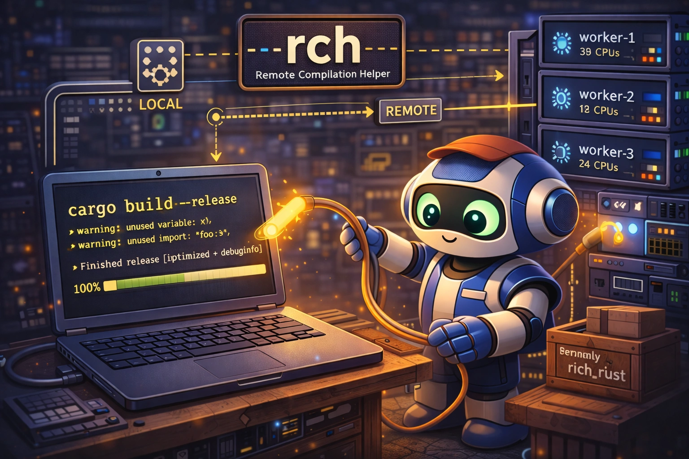
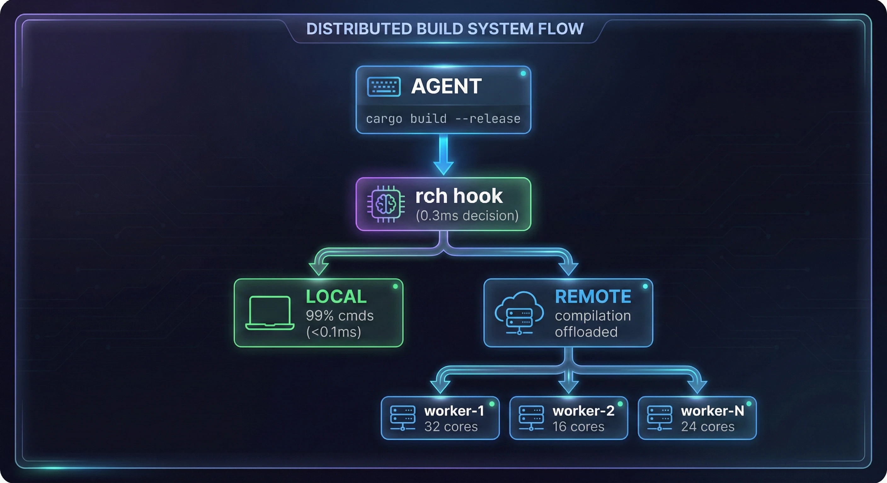

# rch — Remote Compilation Helper

<div align="center">
  
</div>

<div align="center">
<h3>Quick Install</h3>

```bash
curl -fsSL "https://raw.githubusercontent.com/Dicklesworthstone/remote_compilation_helper/main/install.sh?$(date +%s)" | bash -s -- --easy-mode
```

<p><em>Installs `rch` + `rchd`, bootstraps config, and can install/start the background daemon. If remote execution cannot proceed, RCH fails open to local execution.</em></p>
</div>

<div align="center">
  
</div>

<div align="center">

**Transparent remote compilation for multi-agent development**

[](LICENSE)
[](https://www.rust-lang.org/)
[](https://codecov.io/gh/Dicklesworthstone/remote_compilation_helper)

</div>

---

## TL;DR

**Problem**: Many concurrent AI agents can saturate local CPU and make your workstation unusable.

**Solution**: RCH runs as a Claude Code PreToolUse hook, classifies build-like commands in milliseconds, executes them on remote workers, and returns artifacts/output as if they ran locally.

**Design constraint**: RCH is fail-open. If remote execution is not safe/possible, commands run locally.

---

## What RCH Intercepts

RCH currently recognizes and can offload:

| Ecosystem | Intercepted Commands |
|---|---|
| Rust | `cargo build`, `cargo check`, `cargo clippy`, `cargo doc`, `cargo test`, `cargo nextest run`, `cargo bench`, `rustc` |
| Bun/TypeScript | `bun test`, `bun typecheck` |
| C/C++ | `gcc`, `g++`, `clang`, `clang++` |
| Build Systems | `make`, `cmake --build`, `ninja`, `meson compile` |
| Nix | `nix build`, `nix-build`, `nix flake check`, `nix develop -c <cmd>`, `nix shell -c <cmd>` |

Nix builds only route to workers that advertise a `nix` capability (a usable `nix`
binary plus a populated `/nix/store`); on a fleet with no such worker they fall
back to local execution (or are refused under `RCH_REQUIRE_REMOTE=1`, exactly as
with Bun/Node). Nix outputs stay in the worker's `/nix/store` behind a `result`
symlink, so these run as streaming, exit-status-only commands (no artifacts are
copied back — the flake source is synced out, the build runs, the result stays
remote).

RCH explicitly does **not** intercept local-mutating or interactive patterns (examples):

- Package management: `cargo install`, `cargo clean`, `bun install`, `bun add`, `bun remove`
- Bun runners/dev: `bun run`, `bun build`, `bun dev`, `bun x` / `bunx`
- Nix interactive/mutating: bare `nix develop` / `nix shell`, `nix run`, `nix repl`,
  `nix profile`, `nix flake update`, `nix store gc`, `nix-env`, `nix-shell`
- Watch/background/piped/redirected commands where deterministic offload is unsafe

---

## Why It Works Well

- Transparent hook behavior: agents see normal command semantics.
- 5-tier classification pipeline optimized for very fast non-compilation rejection.
- Daemon-owned worker state and slot accounting.
- Cache-aware worker selection and project affinity.
- Queue + cancellation primitives for overloaded scenarios.
- Deterministic reliability subsystems for convergence, pressure handling, and remediation.
- Unified status surface with posture and remediation hints.

---

## Current Architecture

```text
Agent Shell / Claude Code
        |
        v
PreToolUse Hook -> rch (classifier + hook protocol)
        |
        v
      rchd (daemon)
      - worker selection
      - queueing and cancellation metadata
      - health, alerts, telemetry, history
      - reliability subsystems (convergence, pressure, triage)
        |
        v
Remote workers (rch-wkr)
      - execute build/test commands
      - manage worker cache
      - report capabilities/health/telemetry
```

Workspace crates:

- `rch/`: Hook + primary CLI
- `rchd/`: Local daemon + scheduling/reliability APIs
- `rch-wkr/`: Worker execution/caching agent
- `rch-common/`: Shared protocol/types/patterns/UI foundations
- `rch-telemetry/`: Telemetry collection/storage integration

---

## Reliability Model (Operational)

RCH now includes a deterministic reliability stack for multi-repo and multi-worker stability:

- **Path-dependency closure planning**: builds can include required repository closure rather than a single root.
- **Canonical topology enforcement**: worker/project roots are normalized around `/data/projects` and `/dp` conventions.
- **Repo convergence service**: tracks worker drift vs required repos and can repair drift.
- **Disk pressure resilience**: pressure scoring, admission control, safe reclaim with active-build protection.
- **Process triage/remediation**: bounded TERM/KILL escalation with audit trail.
- **Cancellation orchestration**: deterministic cancellation metadata and worker health integration.
- **Unified posture/reporting**: status output includes posture, convergence state, pressure, and actionable remediation hints.

---

## Installation

### Recommended: Installer

```bash
curl -fsSL "https://raw.githubusercontent.com/Dicklesworthstone/remote_compilation_helper/main/install.sh?$(date +%s)" | bash -s -- --easy-mode
```

### From Source

```bash
git clone https://github.com/Dicklesworthstone/remote_compilation_helper.git
cd remote_compilation_helper
cargo build --release
cp target/release/rch ~/.local/bin/
cp target/release/rchd ~/.local/bin/
```

### Source Build Note

All dependencies — including the FrankenTUI (`ftui-*`), `rich_rust`, and TOON
(`tru`) crates — resolve from crates.io, so a clean `git clone && cargo build`
builds on any machine with no special directory layout or pre-cloned
dependency tree required.

---

## First-Time Setup

### Fastest Path

```bash
rch init
```

`rch init` can guide:

1. Worker discovery from SSH config/aliases
2. Worker probing and selection
3. `rch-wkr` deployment
4. Toolchain synchronization
5. Daemon startup
6. Hook installation
7. Validation build

### Manual Path

```bash
# 1) configure workers
mkdir -p ~/.config/rch
cat > ~/.config/rch/workers.toml << 'TOML'
[[workers]]
id = "css"
host = "203.0.113.20"
user = "ubuntu"
identity_file = "~/.ssh/id_rsa"
total_slots = 32
priority = 100
TOML

# 2) start daemon
rch daemon start

# 3) verify workers
rch workers probe --all

# 4) install hook
rch hook install

# 5) check posture
rch check
rch status --workers --jobs
```

---

## Command Surface

Global flags:

```bash
-v, --verbose
-q, --quiet
-j, --json
-F, --format json|toon
--color auto|always|never
--no-color
--schema
--help-json
--robot-triage
```

### Core Operations

```bash
rch daemon start|stop|restart|status|logs|reload
rch workers list|capabilities|probe|benchmark|compare|drain|enable|disable
rch workers init|discover|setup|deploy-binary|sync-toolchain
rch status [--workers] [--jobs]
rch check
rch queue [--watch|--follow]
rch cancel <id> | --all
rch gc [--dry-run] [--workers <id>...]          # reap stale remote target dirs
rch cache warm|clean|status [--workers <id>...] # remote source/target caches
rch rabs gc plan|run|history [--cas-root DIR] [--mode normal|emergency]
rch rabs worker|doctor|inventory|reconcile
```

### Hook + Agent Integration

```bash
rch hook install|uninstall|status|test
rch shim install|status|uninstall      # cargo shim: offload builds started by scripts/Makefiles, not just hooked tool calls
rch agents list|status|install-hook|uninstall-hook
rch diagnose "cargo build --release"
rch admit "cargo build --release"      # read-only preflight: offload / local / queue / defer verdict
rch why miss|refusal                   # RABS: explain a cache-key miss diff or an index refusal code
rch exec -- cargo build --release
rch --robot-triage --json
rch capabilities --json
rch robot-docs guide
```

### Job Mode (non-compilation workloads)

`rch exec --job` admits an arbitrary NON-compilation workload (sharded tests,
fuzzing, benchmarks, mutation testing) onto the same remote rails. It bypasses
ONLY the compilation classifier — the PreToolUse hook never sets it, so
auto-delegation of ordinary commands is impossible.

```bash
rch exec --job -- ./run_shards.sh
# Declared result directories sync back on ANY exit code (including failures):
rch exec --job --result-dir fuzz/corpus --result-dir crashes -- ./fuzz_target.sh
```

Semantics: the remote exit status surfaces verbatim; no toolchain/worker-env
rerun heuristics apply. A declared `--result-dir` that is missing or only
partially transferable fails loudly (`RCH-E309`, exit 102) regardless of the
job's own exit status. Paths must be repository-relative; conflicts with
`--clean-overlay` / `--source-content-receipt` are refused.

### Config + Diagnostics

```bash
rch config show|get|set|reset|init|validate|lint|doctor|edit|diff|export
rch doctor [--fix] [--dry-run] [--install-deps]
rch doctor --reliability [--check-schemas] [--scope <scope>] [--strict|--lenient] [--json]
rch doctor --reliability --watch [--watch-interval N] [--transitions-only]
rch doctor --runbook RCH-Rnnn | --runbook-list
rch error explain <RCH-Ennn|RCH-Innn|RCH-Rnnn> | list [--category <name>]
rch self-test [--worker <id>|--all]
rch self-test status
rch self-test history --limit 10
```

### Fleet + Release + UX

```bash
rch update [--check|--rollback|--fleet]
rch fleet deploy|rollback|status|verify|drain|history
rch speedscore <worker>|--all [--history]
rch dashboard   # alias: rch tui
rch web
rch schema export|list
rch completions generate|install|uninstall|status
```

### Agent Discovery Surface

For AI agents and automation, start with:

```bash
rch --robot-triage --json       # quick_ref + recommended commands + health probes
rch capabilities --json         # commands, aliases, env vars, exit codes, output formats
rch robot-docs guide            # in-tool operating guide, no README lookup needed
rch --help-json workers/list    # machine-readable help for nested command paths
```

`--json` uses the standard API envelope for command output; `--format toon`
emits the same data as TOON. The legacy `rch --capabilities` flag remains a
raw JSON shortcut for lightweight discovery.

---

## Configuration

Primary files:

- User config: `~/.config/rch/config.toml`
- Worker list: `~/.config/rch/workers.toml`
- Project override: `.rch/config.toml`
- Optional project excludes: `.rchignore`

Precedence (highest first):

1. CLI flags
2. Environment variables
3. Profile defaults
4. `.env` / `.rch.env`
5. Project config
6. User config
7. Built-in defaults

### Canonical Project Root

By default rch expects projects to live under `/data/projects` (with the `/dp`
alias symlink). Both roots are configurable, so repos under `~/code`,
`/workspace`, etc. work without relocating anything:

```toml
[path_topology]
canonical_root = "/home/me/code"   # default: /data/projects
alias_root = "/home/me/code"       # default: /dp (set equal to canonical_root if you have no alias)
```

Or via the CLI / environment (env wins over TOML):

```bash
rch config set path_topology.canonical_root /home/me/code
rch config set path_topology.alias_root /home/me/code
# or
export RCH_CANONICAL_PROJECT_ROOT=/home/me/code
export RCH_ALIAS_PROJECT_ROOT=/home/me/code
```

Empty strings are treated as unset (defaults apply). See
`docs/guides/configuration.md` (`[path_topology]`) for details.

### Minimal Example

```toml
[general]
enabled = true
force_local = false
force_remote = false
socket_path = "~/.cache/rch/rch.sock"
log_level = "info"

[compilation]
confidence_threshold = 0.85
min_local_time_ms = 2000
remote_speedup_threshold = 1.2
build_slots = 4
test_slots = 8
check_slots = 2
build_timeout_sec = 300
test_timeout_sec = 1800
bun_timeout_sec = 600
external_timeout_enabled = true

[transfer]
compression_level = 3
remote_base = "/data/tmp/rch"
# Optional per-attempt source-sync cap. When unset, the default is payload-aware:
# 30 seconds plus one second per MiB, capped at one hour.
# sync_timeout_ms = 120000
adaptive_compression = true
verify_artifacts = false
max_transfer_mb = 2048

[selection]
strategy = "balanced"

[self_healing]
hook_starts_daemon = true
daemon_installs_hooks = true

[alerts]
enabled = true
suppress_duplicates_secs = 300
```

Built-in worker selection defaults to `balanced`, which blends speed, load,
health, and cache affinity. Use `priority` only when you want explicit
worker-priority control, and `fair_fastest` when you want extra load spreading.

### Worker Config Example

```toml
[[workers]]
id = "css"
host = "203.0.113.20"
user = "ubuntu"
identity_file = "~/.ssh/id_rsa"
total_slots = 32
priority = 100
tags = ["fast", "ssd"]
```

---

## Output Modes

RCH auto-selects output mode by context:

- `hook`: strict JSON for hook protocol
- `machine`: explicit machine output (`--json`, `--format`)
- `interactive`: rich terminal rendering
- `colored`: ANSI-only when forced without TTY
- `plain`: text fallback

Environment controls:

- `RCH_JSON=1`, `RCH_HOOK_MODE=1`
- `NO_COLOR=1`, `FORCE_COLOR=1`, `FORCE_COLOR=0`
- `RCH_OUTPUT_FORMAT=json|toon`, `TOON_DEFAULT_FORMAT`

JSON responses use a stable envelope (`api_version`, `timestamp`, `success`, `data`, `error`).

---

## Placement Controls

Worker placement, strict-remote, queue, wait-timeout, visibility, and target-dir
behavior are first-class, canonical controls — not folklore. The authoritative
list is discoverable at runtime (`rch capabilities --json`), and the resolved
plan for any command is shown by `rch diagnose <command> --json` under
`data.placement` (and in the human `Placement Controls` section):

| Control | Env (aliases) | Effect |
|---|---|---|
| Requested worker | `RCH_WORKER` (`RCH_WORKERS`) | Request specific worker(s) by id. Still passes capability/admission checks; an inadmissible requested worker is **refused** with a stable `RCH-Innn` reason code and a next action — never silently swapped. |
| Requested profile | `RCH_PRESET` | Named execution profile (recorded as `requested_profile`). |
| Strict remote (fail-closed) | `RCH_REQUIRE_REMOTE` | Refuse local fallback (proof mode). Takes precedence over `RCH_FORCE_REMOTE`. |
| Force remote (fail-open) | `RCH_FORCE_REMOTE` | Always attempt offload (bypass local-time/speedup gating) but still fail open to local. Distinct from `RCH_REQUIRE_REMOTE`. |
| Queue when busy | `RCH_QUEUE_WHEN_BUSY` (default `1`) | Wait for a busy worker instead of falling back to local. Set `0` to disable. |
| Wait timeout | `RCH_DAEMON_WAIT_RESPONSE_TIMEOUT_SECS` (`RCH_DAEMON_RESPONSE_TIMEOUT_SECS`) | Max seconds to wait for a queued worker. |
| Visibility | `RCH_VISIBILITY=none\|summary\|verbose` (`RCH_QUIET`, `RCH_VERBOSE`) | Hook output verbosity. |
| Target dir | `RCH_DISABLE_TARGET_REUSE` | Legacy unique-per-job remote target dir instead of the pooled, reuse-friendly dir. |
| Source-sync timeout | `RCH_SYNC_TIMEOUT_MS` | Per-attempt source-upload timeout in milliseconds (1000..=3600000). Unset uses the payload-aware default. This does not change remote Cargo or artifact-return timeouts. |

The resolved plan reports `requested_worker`, `requested_profile`,
`effective_worker`, `strict_remote_policy`, `queue_policy`, `visibility_mode`,
`wait_timeout_ms`, `target_dir_policy`, the requested-worker admissibility
outcome, and a `diagnostics` list. Any control value that cannot be applied as
written (an unrecognized value or a superseded alias) surfaces a diagnostic
rather than being silently ignored.

---

## Monitoring and Observability

RCH exposes observability through daemon APIs and metrics:

- daemon health/readiness endpoints
- Prometheus metrics collection
- OpenTelemetry tracing integration
- telemetry-backed worker SpeedScore history
- queue/build history, active alerts, cancellation metadata in status APIs

Quick checks:

```bash
rch status --workers --jobs
rch speedscore --all
rch doctor --json
```

---

## Testing and Validation

Workspace checks:

```bash
cargo fmt --check
cargo check --workspace --all-targets
cargo clippy --workspace --all-targets -- -D warnings
cargo test --workspace
```

Reliability and E2E suites are provided under:

- `tests/`
- `tests/e2e/`
- `rch-common/tests/` (contract/reliability/perf suites)

If you are running CPU-intensive validation manually and want explicit offload:

```bash
rch exec -- cargo check --workspace --all-targets
rch exec -- cargo test --workspace
rch exec -- cargo clippy --workspace --all-targets -- -D warnings
```

When local fallback is not acceptable, set `RCH_REQUIRE_REMOTE=1` on the
`rch exec` process and keep the build command as direct argv:

```bash
RCH_REQUIRE_REMOTE=1 rch exec -- cargo test --workspace
RCH_REQUIRE_REMOTE=1 rch exec -- cargo clippy --workspace --all-targets -- -D warnings
```

### Exact source-content receipts

Proof-oriented callers can require a single-worker, fail-closed source transfer
and retain the exact regular-file bytes admitted on that worker:

```bash
RCH_REQUIRE_REMOTE=1 rch exec --source-content-receipt -- \
  cargo test --locked --workspace
```

Receipt mode resolves the active Cargo path-dependency closure, gives every
root an invocation-unique worker path, transfers with checksum comparison, and
reopens every selected file before and after the command. The emitted
`rch.source_content_receipt.v1` JSON binds the worker and build IDs, exact
command digest and exit code, transfer filter policy, per-root file paths,
lengths, executable bits, SHA-256 digests, and content roots. Any unproved
dependency closure, transfer delta, worker verification error, local lasting
change, retry, or local fallback refuses the invocation instead of emitting a
receipt. Receipt mode currently requires the Unix rsync transport and cannot be
combined with clean-overlay mode.

The receipt is emitted after the remote command and its post-command source
barrier, but before ordinary artifact retrieval completes. Artifact-grade
callers must therefore retain both the receipt and the later successful
retrieval/terminal transcript; the receipt alone is not proof that build
artifacts reached the caller. A recursive local mutation watcher is still
needed when transient edit-and-restore (ABA) detection is part of the caller's
source-stability contract.

### Clean Git overlays for shared working trees

`rch exec` can build an immutable committed tree plus an explicit, repeatable
set of local paths without transferring unrelated working-tree changes:

```bash
RCH_REQUIRE_REMOTE=1 rch exec \
  --base HEAD \
  --clean-overlay \
  --overlay-path src/lib.rs \
  --overlay-path tests/focused.rs \
  -- cargo test --test focused

RCH_REQUIRE_REMOTE=1 rch exec \
  --base HEAD \
  --clean-overlay \
  --no-overlay \
  -- cargo check --workspace --all-targets
```

The client resolves `--base` to a commit object, streams that Git archive into
a fresh isolated worker path, and then uploads only the literal repository-
relative `--overlay-path` selections. Modified and untracked files are
supported; selected deletions, absolute/traversing paths, Git metadata,
non-ASCII/backslash/control-character paths, case-only or otherwise ambiguous
filesystem spellings, overlay symlinks, empty overlay directories, submodules,
and Git archive `export-ignore`/`export-subst` attributes fail closed. Exactly
one of one-or-more `--overlay-path` options or `--no-overlay` is required.
Clean-overlay mode also implies remote-only execution even when
`RCH_REQUIRE_REMOTE` was omitted, so a worker or transfer failure never falls
back to the ambient local tree.
Explicit clean-overlay execution also admits the read-only `cargo fmt --check`
diagnostic, which the ordinary interception classifier intentionally leaves
local.

Clean-overlay currently materializes one Git repository. In-repository Cargo
workspace members are present in the archive. External path dependencies are
outside the source-identity guarantee: callers must independently ensure they
cannot resolve to ambient worker state. The client re-fingerprints overlays
after upload and refuses execution if their contents changed during admission
or transfer.

Do not batch several Cargo commands behind a shell wrapper such as
`rch exec -- bash -lc "cargo test ... && cargo test ..."`. Shell-wrapped
commands are classified as non-compilation for hook safety. Under
`RCH_REQUIRE_REMOTE=1`, RCH refuses that local fallback before executing the
shell and reports `RCH-E301`; without the env var, ordinary non-compilation
commands may still run locally. For several focused checks, run separate direct
`RCH_REQUIRE_REMOTE=1 rch exec -- cargo ...` invocations.

---

## Security Model

- Transport uses SSH.
- Worker commands are constrained to classified execution paths.
- Sensitive field masking and structured error taxonomy are built in.
- Sigstore/checksum verification is part of update/release flows.
- Hook path remains fail-open to avoid deadlocks/stalls.

Operational recommendations:

1. Use workers you control.
2. Use dedicated SSH keys for worker access.
3. Keep workers patched and isolated.
4. Enable telemetry/alerting for production-like use.

---

## Limitations

- Designed around SSH-based Linux worker environments.
- Tooling assumptions are strongest for Rust and selected build/test commands.
- Remote performance gains depend on network + worker capacity + project shape.
- Web dashboard workflows require the `/web` stack and its runtime dependencies.

---

## FAQ

### Does RCH block my command if the daemon/workers fail?
No. It fails open and allows local execution.

### Can I force local or force remote per project?
Yes, via `.rch/config.toml` (`general.force_local` / `general.force_remote`).

### Is queue/cancel supported?
Yes. Use `rch queue` and `rch cancel`.

### Can I inspect why a command is or is not intercepted?
Yes. Use `rch diagnose "<command>"`.

---

## About Contributions

Please don't take this the wrong way, but I do not accept outside contributions for my projects. You can still open issues and PRs for discussion/proof-of-fix, but I review and re-implement changes independently.

---

## License

MIT License **with an OpenAI/Anthropic rider** — this is not ordinary
OSI MIT: no rights are granted to the restricted parties named in the
rider. See [LICENSE](LICENSE) for the exact, controlling terms
(SPDX: `LicenseRef-MIT-OpenAI-Anthropic-Rider`).
